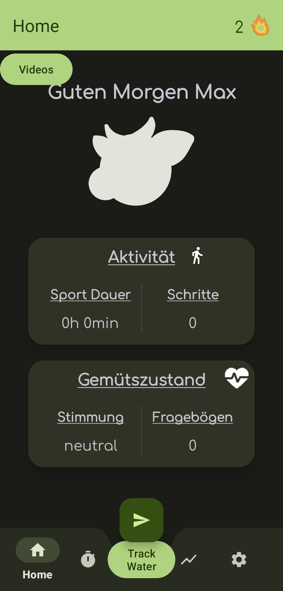
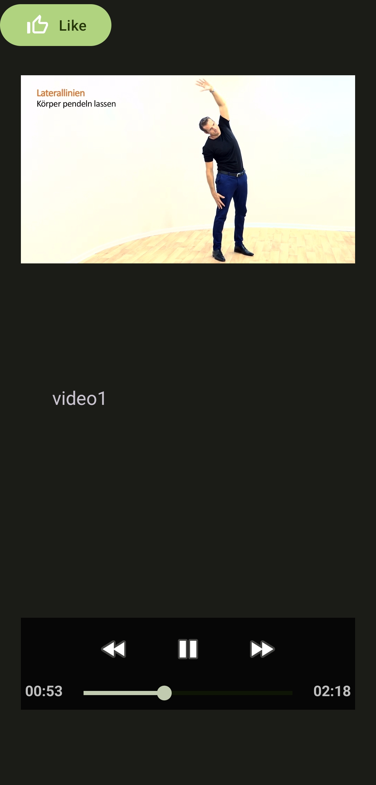
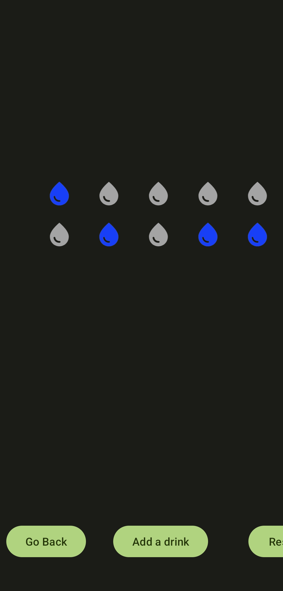
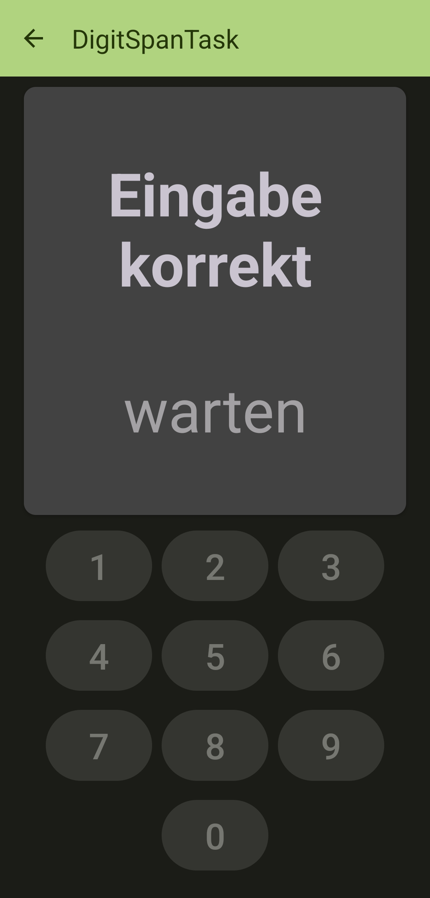

# Spomoo Android App
The [original](https://github.com/juliusmuet/Spomoo) Spomoo Android App was developed by Julius Müther and has been further developed by four other students as part of the "Android App Evolution" internship at RUB.

Following features have been added to the project: Video Library, Video Notifications, Water Tracker, Digit Span Task. The user can access the video library to watch short exercise videos. At random times, the app will notify the user twice a day to remind the user to do these exercises. In addition, the user can track how much water they drank, and they can also do the digit-span task to test their short-term memory.

For more information about the other features and functionalities, visit [Spomoo Github Repository](https://github.com/juliusmuet/Spomoo).

## App Screenshots

More screenshots can be viewed here: https://github.com/kimm310/spomoo_evo/tree/master/screenshots

## Authors
- [@Julius](https://github.com/juliusmuet)
- [@Sir-A](https://github.com/Sir-A)
- [@davidstk1311](https://github.com/davidstk1311)
- [@kimm310](https://github.com/kimm310)
- [@Charlotte](https://github.com/Chaii0)

## License
Copyright 2023 Julius Müther

Permission is hereby granted, free of charge, to any person obtaining a copy of this software and associated documentation files (the “Software”), to deal in the Software without restriction, including without limitation the rights to use, copy, modify, merge, publish, distribute, sublicense, and/or sell copies of the Software, and to permit persons to whom the Software is furnished to do so, subject to the following conditions:

The above copyright notice and this permission notice shall be included in all copies or substantial portions of the Software.

THE SOFTWARE IS PROVIDED “AS IS”, WITHOUT WARRANTY OF ANY KIND, EXPRESS OR IMPLIED, INCLUDING BUT NOT LIMITED TO THE WARRANTIES OF MERCHANTABILITY, FITNESS FOR A PARTICULAR PURPOSE AND NONINFRINGEMENT. IN NO EVENT SHALL THE AUTHORS OR COPYRIGHT HOLDERS BE LIABLE FOR ANY CLAIM, DAMAGES OR OTHER LIABILITY, WHETHER IN AN ACTION OF CONTRACT, TORT OR OTHERWISE, ARISING FROM, OUT OF OR IN CONNECTION WITH THE SOFTWARE OR THE USE OR OTHER DEALINGS IN THE SOFTWARE.
